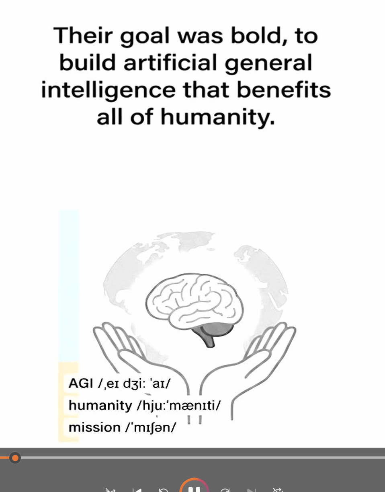

# story-handdrawn-remotion

把一段 中文/英文 故事文本变成 「手绘日记漫画风」竖屏视频。Remotion技术的视频SKill. 基于 Agnes Image +edge-tts 全免费视频制作方案。

核心方法论：**不是把一张漂亮图配文字朗读，而是把每句故事拆成「文字 → 黑白画稿 → 彩色插画」三阶段横向擦除揭示，让一句话被画出三次。**

## 工具链

- **图片**：agnes（Agnes Image 2.1 Flash，默认，当前免费） / apiz CLI（`fal-ai/nano-banana-2`，付费可选）
- **字幕**：默认 font 模式（MaShanZheng 字体，Remotion TextWipe 实时画） / image2 模式（仅 apiz 支持图片模型在画板上画手写体）
- **音频**：MiniMax T2A v2（默认 `female-shaonv`） / edge-tts（免费 fallback）
- **切层**：ffmpeg（master 切 text/bw/color 三层；font 模式下不切 text_image）
- **渲染**：Remotion 4.x（React 控横向擦除 + 翻书转场）

## 快速开始

## 安装

```bash
在workbuddy，codex, claude code，直接命令要求安装skill:https://github.com/liangdabiao/story-handdrawn-remotion
```

安装后，技能会在 workbuddy,Claude Code 、codex 中按学科关键词自动激活，也可手动调用。

例如： 利用 story-handdrawn-remotion skill 帮忙制作一个视频：  王安石变法的故事

❯ story-handdrawn-remotion  ：英文教学制作： deepmind的故事

---

## Demo视频演示



https://www.bilibili.com/video/BV1a23Z6jEkn/?vd_source=86926e418c83af75f6850b5546388a79

https://www.bilibili.com/video/BV1un3X6fEDk/?vd_source=86926e418c83af75f6850b5546388a79

英文：
https://www.bilibili.com/video/BV1PoM26FErf/?vd_source=86926e418c83af75f6850b5546388a79


## 后端生图API选择

| 后端 | 收费 | 中文手写体字幕 | 适用 |
|---|---|---|---|
| `--backend agnes`（默认） | 当前 $0/张 | 必须用 `--text-mode font`（agnes 不会画中文） | 默认免费全流程 |
| `--backend apiz` | 付费 | 可用 `--text-mode image2`（apiz 在画板上画手写体） | 老样板复用 / 想要图片模型真迹字幕 |

不显式传 `--text-mode` 时脚本按后端自动选：agnes → font，apiz → image2。
agnes key免费申请地址： https://agnes-ai.com/

## 输入模式

| 模式 | 适合 | 入口脚本 |
|---|---|---|
| 故事文本（默认） | 中文故事、日记、绘本 | `gen_story_images.py` |
| 上传图片 | 已有手绘扫描件 | `import_uploaded_pages.mjs` |

## 转场

- `--transition cut`（默认，硬切）
- `--transition page-flip --transition-sec 0.7`（右下角卷页）

## 英文教学模式（`--lang en`，英语教学专用）

除了中文手绘日记风，本 skill 还支持**英文教学模式**，用于中小学英语教学视频制作。加 `--lang en` 后，所有文案、图片生成、旁白都按英文，生图风格从「手绘日记漫画」切换到「Oxford 英语课本教育闪卡」。

### 核心区别

| 项 | `--lang zh`（默认） | `--lang en` |
|---|---|---|
| 风格 | 手绘日记漫画（蜡笔色 + 记号笔轮廓） | Oxford 英语课本闪卡（清爽教育插画风） |
| 图片内容 | 纯插画（字幕由 Remotion 渲染） | **句子 + 关键词音标 + 插画烧在同一张图上** |
| 字幕模式 | font（MaShanZheng，agnes 不画中文） | image2（模型把教育文字画在图上） |
| 关键词 | 无 | 每句自动提取 2-4 个重点词汇，带 IPA 音标 |
| 旁白语音 | `zh-CN-XiaoyiNeural` | `en-US-JennyNeural` |
| 估时公式 | 按字数 | 按词数（英文朗读更慢，时间更长） |

### 教育闪卡设计

英文模式下每张 master 是一张完整的教育闪卡（参考 Oxford 英语课本风格）：

- **顶部文字区**（y=0–510）：英文句子 + 关键词 IPA 音标
- **底部插画区**（y=512–1536）：与句意相关的彩色插画
- 关键词由 `extract_keywords()` 自动提取（过滤停用词，按出现顺序去重，最多 4 个）
- 如需手动指定关键词，在 `visual_plan.json` 里用 dict 格式覆盖：
  ```json
  {
    "01": {
      "direction": "A rabbit in a green meadow",
      "keywords": ["rabbit", "meadow", "hop"]
    }
  }
  ```

### 三层揭示的教学意义

英文教学闪卡仍然保留「文字 → 黑白画稿 → 彩色插画」三阶段横向擦除揭示，教学节奏明确：

1. **文字层**（text_image）：先显示句子 + 关键词音标 → 学生跟读、学发音
2. **黑白层**（bw）：线稿出现 → 理解句意
3. **彩色层**（color）：完整插画 → 视觉记忆

### 用法示例

```bash
# 推荐：apiz 后端，文字渲染最稳（付费）
python scripts/gen_story_images.py examples/story_en.txt --lang en --backend apiz --title "English Story"

# 免费：agnes 后端（文字可能不完美，70% 质量即可）
python scripts/gen_story_images.py examples/story_en.txt --lang en --title "English Story"

# dry-run 先看 prompt 不生图
python scripts/gen_story_images.py examples/story_en.txt --lang en --dry-run

# 手动运行渲染：
npx remotion render src/index.ts Part2 out/Part2.mp4 --scale=0.5 --crf=28 --concurrency=1 --overwrite
```

### 英文故事写作规范

- 一句一拍，英文按 `. ! ? ;` 切句（中文按 `。！？；`）
- 单句 ≤ 120 字符（softLimit），超长按逗号/连接词切
- 自然段用空行分隔
- 每句配一张闪卡 = 一个画面

### TTS 配音

narration.yaml 加 `lang: en`，voice 自动切英文：

```yaml
lang: en
voice: en-US-JennyNeural   # edge 默认女声；男声用 en-US-GuyNeural
speed: 0.95                 # 教学可稍慢
scenes:
  - id: s01
    text: "The little rabbit hopped through the green meadow."
  - id: s02
    text: "..."
```

### 后端选择建议

| 后端 | 英文文字渲染 | 收费 | 适用 |
|---|---|---|---|
| `--backend apiz`（推荐） | 稳，句子+音标清晰 | 付费 | 教学闪卡首选 |
| `--backend agnes`（默认） | 可能画满全画布覆盖文字区（已知问题） | 免费 | 接受 70% 文字质量 |

### 常见坑

- **agnes + image2 画满全画布** → 用 `--backend apiz` 更稳，或接受 70%
- **IPA 音标渲染不清** → 模型对音标字符渲染能力有限。可去掉关键词只保留句子（`visual_plan.json` 设 `"keywords": []`），或用 Remotion 后期叠加音标文字
- **英文分句切太碎** → 手动在 story.txt 调整句号位置
- **估时太长** → 配音后 `apply_timeline.py` 会用音频真实时长覆盖估时

详细文档见 [SKILL.md](SKILL.md) 「英文教学模式」章节。

## 文档导航

- 完整 pipeline：`references/pipeline.md`
- Remotion 组件 API：`references/components.md`
- apiz prompt 配方：`references/prompt-recipes.md`
- 守护文档（触发条件、风格 DNA、验收清单）：`SKILL.md`


## 感谢

https://linux.do 社区支持
https://github.com/gnipbao/story-to-handdrawn-video  技术参考