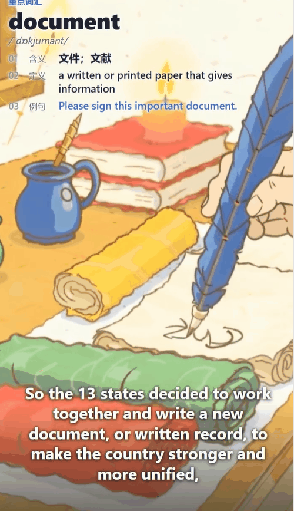

# story-handdrawn-video

把一段 中文/英文 故事文本变成 9:16 竖屏（720×1280）手绘蜡笔风短视频。Remotion 技术的视频 Skill。基于 Agnes Video V2.0（纯文生视频，当前 $0/秒）+ edge-tts（免费旁白）的全免费视频制作方案。

核心方法论：**先 TTS 定时长，再纯文生视频——每场直接是一个 Agnes 文生视频片段，画面自己会动；不用静帧、不用擦除、不用翻页。字幕永远由 Remotion 确定性渲染（MaShanZheng 毛笔字），禁止让视频模型画文字。**

## 工具链

- **视频**：Agnes Video V2.0（`agnes-video-v2.0`，当前 $0/秒，纯文生视频，无参考图、无图生视频、无 character_reference）
- **字幕**：MaShanZheng 毛笔字，Remotion 确定性渲染（prompt 里 negative 强制排除画面文字，禁止让视频模型画中文）
- **音频**：edge-tts（默认 `zh-CN-XiaoyiNeural`，免费，无需 API key；英文 `en-US-JennyNeural`）
- **时序**：ffprobe 量每段旁白真实时长 → 按 24fps、`8n+1` 规则算 num_frames（上限 441 ≈ 18.3s）
- **渲染**：Remotion 4.x（组装视频片段 + 字幕 + 音轨）

## 快速开始

## 安装

```bash
在workbuddy，codex, claude code，直接命令要求安装skill:https://github.com/liangdabiao/story-handdrawn-video
```

安装后，技能会在 workbuddy,Claude Code 、codex 中按学科关键词自动激活，也可手动调用。

例如： 利用 story-handdrawn-video skill 帮忙制作一个视频：  王安石变法的故事

❯ story-handdrawn-video  ：英文教学制作： deepmind的故事

---

## Demo视频演示



英文：
https://www.bilibili.com/video/BV1PDuj61EWs/?vd_source=86926e418c83af75f6850b5546388a79


## 后端 API 选择

本 skill 的视频后端固定为 Agnes Video V2.0（纯文生视频，当前 $0/秒），异步任务 + 轮询。免费 key 限流 **1 req/min**，脚本默认 `--concurrency 1` 串行，429 自动等 65s 重试。音频后端固定 edge-tts（免费、无需 API key）。

| 后端 | 类型 | 收费 | 适用 |
|---|---|---|---|
| Agnes Video V2.0（默认） | 文生视频 | 当前 $0/秒 | 默认全流程，每场一段 mp4 |
| edge-tts（默认） | 语音合成 | 免费 | 旁白，无需 API key |

Agnes key 免费申请地址： https://agnes-ai.com/

## 输入模式

| 模式 | 适合 | 入口脚本 |
|---|---|---|
| 故事文本（默认） | 中文童话 / 生活日记 / 英文课文 | `gen_story_videos.py` |
| 现成 mp3 + LRC | 自带专业录音和 LRC 的教学片（跳过 TTS） | `slice_from_lrc.py` 切片 + `gen_story_videos.py --skip-tts --paragraph-beats` |

## 视觉风格

- `--style crayon`（默认）：Q 版手绘蜡笔风（蜡笔色 + 记号笔轮廓），童话 / 生活 / 日记
- `--style textbook`：牛津教材叙事插画风，英语课文 / 听力 / 词汇 / 历史口播（详见下方「英文教学模式」）

每场 prompt 由脚本三段式拼接：固定风格头（`STYLE_HEADER`）+ 该场动作主体（`visual_plan` 或自动从原句提取）+ 固定运动尾（`MOTION_FOOTER`，locked camera / paper cutouts / no drift）。

## 英文教学模式（`--style textbook`，英语教学专用）

除了中文手绘蜡笔风，本 skill 还支持**英文教学模式**，用于英语课文 / 听力 / 词汇教学视频制作。加 `--style textbook` 后，画面风格从「Q 版手绘蜡笔」切换到「Oxford 教材叙事插画」，并由 `TeachingCard.tsx` 在画面上确定性叠加透明教学卡（关键词 / IPA / 释义 / 定义 / 例句）。

### 核心区别

| 项 | `--style crayon`（默认） | `--style textbook` |
|---|---|---|
| 风格 | Q 版手绘蜡笔风（蜡笔色 + 记号笔轮廓） | Oxford 教材叙事插画（清爽教育插画风） |
| 画面 | 纯文生视频片段，画面会动 | 叙事场景视频片段，含支撑句意的可见动效（帆船航行 / 羽毛笔书写 / 人物走动 / 旗帜飘动 / 翻页） |
| 字幕 | MaShanZheng 毛笔字（Remotion 渲染） | MaShanZheng 毛笔字 + 底部整句英文字幕 |
| 教学卡 | 无 | `TeachingCard.tsx` 确定性叠加（关键词 / IPA / 释义 / 定义 / 例句） |
| 关键词 | 无 | 每场由 `teaching_content.json` 提供 keyword / ipa / meaning / definition / example |
| 旁白语音 | `zh-CN-XiaoyiNeural`（zh）/ `en-US-JennyNeural`（en） | 同左 |
| 估时 | 按字数（中文）/ 词数（英文，朗读更慢） | 同左 |

### 教学卡设计

textbook 模式下每场是一个叙事场景视频 + 透明教学卡覆盖（`TeachingCard.tsx`）：

- **深蓝顶条**「范例与讲解」→ 蓝标「重点词汇」→ 关键词粗体大字 → IPA → 三行 `01 含义(中) / 02 定义(英) / 03 例句(蓝)`
- 卡片**完全透明**：除深蓝顶条外不要任何白底、不要任何 `backdrop-filter: blur`（毛玻璃会把视频糊成奶白板，和挡视频一样）
- 文字用白色 `text-shadow` 光晕（`0 1px 2px rgba(255,255,255,.95), 0 0 8px rgba(255,255,255,.85), 0 0 14px rgba(255,255,255,.6)`）保证在任何视频背景上可读
- 高度只包住内容，底部露视频；**绝不能整屏白底挡住动画**；底部叠整句英文字幕
- 每场的教学字段由 `teaching_content.json` 提供（你自己写教学内容，不是从原文搬）。`Scene.tsx` 检测到这些字段自动切教学卡模式。

### 教学卡的教学意义

textbook 模式没有三层擦除，每场是一个会动的叙事视频 + 透明教学卡：

1. **教学卡**：先显示关键词 + IPA + 释义 / 定义 / 例句 → 学生学词汇、学发音
2. **叙事视频**：场景画面 + 底部整句字幕 → 理解句意、视觉记忆

### 用法示例

```bash
# 推荐：textbook 风格 + 教学内容
python scripts/gen_story_videos.py story.txt \
  --title "CQ001 What is the supreme law" \
  --style textbook --lang en \
  --teaching-content teaching_content.json

# 免费：crayon 默认风格（中文故事）
python scripts/gen_story_videos.py story.txt --title "我的小猫"

# dry-run 先看 prompt 不生视频
python scripts/gen_story_videos.py story.txt --lang en --style textbook --dry-run

# 用现成 mp3+LRC 切片后跑（跳过 TTS）
python scripts/slice_from_lrc.py CQ001.mp3 CQ001.lrc --out-dir public/audio/narration
python scripts/gen_story_videos.py story.txt --style textbook --lang en \
  --teaching-content teaching_content.json --skip-tts --paragraph-beats

# 渲染（720×1280 预览即默认成片）
npm run render:preview   # → out/story-preview.mp4
npm run render           # → out/story.mp4（1080×1920，需用户明确要高清时才跑）
```

### 教学内容文件（`teaching_content.json`）

textbook 模式建议提供。每场一条，`visual` 优先于 `--visual-plan` 和原句作为 scene body（你的教学内容是单一来源）：

```json
{
  "s01": {
    "keyword": "supreme law",
    "ipa": "/səˈpriːm lɔː/",
    "meaning": "最高法律",
    "definition": "the highest legal authority in a country, above all other laws",
    "example": "The Constitution is the supreme law of the land.",
    "visual": "A colonial town square: a citizen in a long coat standing before a tall columned building, looking up at a large balance scale, Oxford textbook illustration, no text anywhere"
  }
}
```

### visual direction 硬规则（textbook 模式，重要！）

**必须**：每场写「谁 + 在哪 + 做什么」三要素的叙事场景；用环境词（classroom / town square / coastline / meeting room / tavern / desk / porch）；给一个能动的元素；末尾加 `Oxford textbook illustration, no text or letters anywhere`。

**禁止**：`pure white background`（Agnes 会画居中图标 + 左右大白边）、`icon` / `diagram` / `exploded-view` / `thought bubble` / `balance scale in center` 等抽象词、floating arrow / radiating lines 这种装饰、「same scene as X」引用。

判断标准：**visual 读起来像不像一幅能讲故事的插画**。像图标 logo / 教学示意图 / 抽象概念图就重写。

### 英文故事写作规范

- 一句一拍，英文按 `. ! ? ;` 切（中文按 `。！？；`）
- 单句 ≤ 120 字符（英文 softLimit）/ ≤ 36 字（中文 softLimit），超长会按逗号 / 连接词再切
- 自然段用空行分隔
- 每句一场 = 一段视频

### TTS 配音

`narration.yaml` 加 `lang: en`，voice 自动切英文：

```yaml
lang: en
voice: en-US-JennyNeural   # edge 默认女声；男声用 en-US-GuyNeural
speed: 1.0
scenes:
  - id: s01
    text: "The little rabbit hopped through the green meadow."
  - id: s02
    text: "..."
```

### TTS 配音

视频后端固定 Agnes Video V2.0，TTS 固定 edge-tts（免费、无需 API key）。无需选后端，直接在 `narration.yaml` 配 voice / speed 即可。

### 常见坑

- **Agnes Video 限流 1 req/min**（免费 key）：默认串行，每段 30s–2.5min，15 段约 15–40 分钟。429 会自动等 65s 重试，不要中断。
- **`num_frames` 必须 `8n+1`**：脚本自动算，上限 441（≈18.3s @ 24fps）。旁白 >18s 画面会早结束 → 在 story.txt 拆短句子。
- **视频里出现乱码中文/英文** → prompt 漏了 negative。不要重跑整轮，把它写进下一场的 negative 即可；已有片段按 70% 接受，或单删那一个 `<sid>.mp4` 重跑。
- **视频不许重跑（硬规则）**：脚本默认 skip 已存在的 `<sid>.mp4`，省时间省钱。不要为了「看看 prompt 改了会不会更好」而 `rm -rf public/assets/videos/` 重跑整轮。只有某段真的无法观看（全黑/全白/画面完全错误）才删那一个单跑。
- **`rtk npm install` 会失败** → 用原生 `npm install`。
- **textbook 模式 visual 不要写 icon/diagram/抽象词** → 必须写叙事场景（谁 + 在哪 + 做什么），否则 Agnes 会画成居中图标 + 大白边。

详细文档见 [SKILL.md](SKILL.md) 「英语教学模式」章节。

## 文档导航

- 完整 pipeline：`references/pipeline.md`
- Prompt 配方 & visual_plan 写法：`references/prompt-recipes.md`
- 守护文档（触发条件、风格 DNA、验收清单）：`SKILL.md`


## 感谢

https://linux.do 社区支持 
