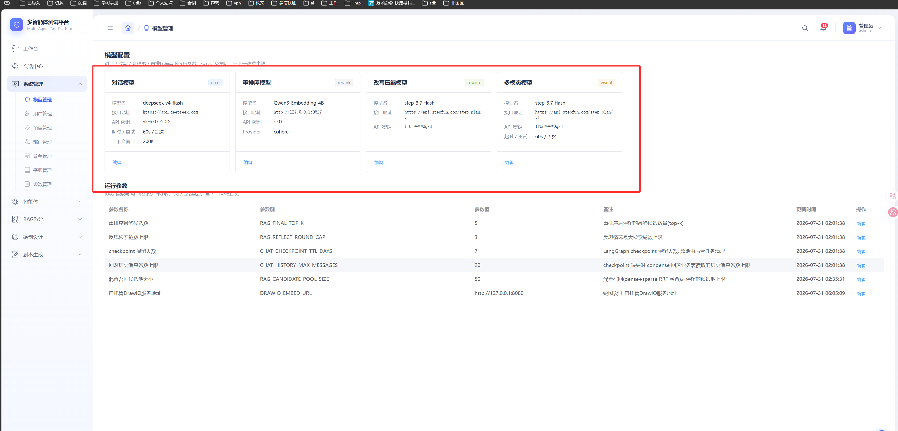
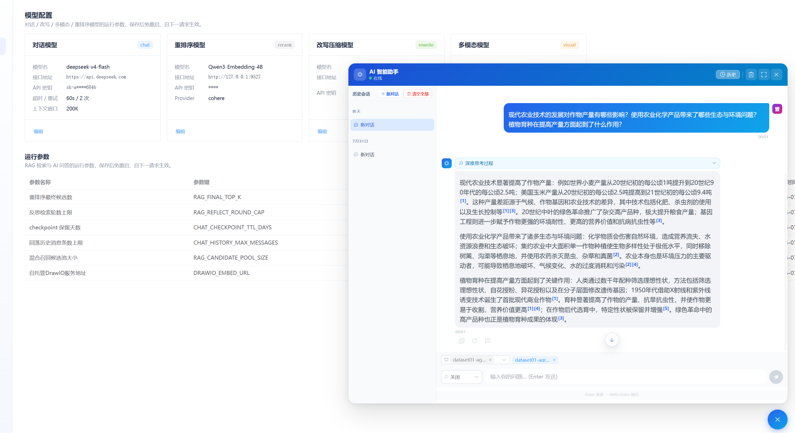

# RAG 系统

## 1. 先决条件

1. PostgreSQL 18.0+（表结构使用内置 `uuidv7()`，要求 PG ≥ 18）
2. Qdrant@latest 向量库（仅需启动服务；知识库集合由后端首次向量化写入时自动创建，无需手工建集）

```bash
# qdrant  http://127.0.0.1:6333/dashboard
podman run -d  \
--name qdrant \
-p 6333:6333  \
-p 6334:6334  \
-v qdrant_storage:$HOME/mydata/qdrant/storage \
-e QDRANT__SERVICE__API_KEY=95279527 \
docker.io/qdrant/qdrant
```

3. 模型推理服务（本地 vLLM 部署见 [README.md](../README.md) 二.节，也可使用云端 OpenAI 兼容 API）：
   - 池化模型（embedding + rerank）：如 `Qwen3-Embedding-4B`（`--runner pooling`，默认端口 9527）
   - 生成模型（chat + rewrite）：如 `Qwen3.5-2B`（需 `--enable-auto-tool-choice --tool-call-parser hermes`，默认端口 9528）
   - 显存至少 16G（CUDA/ROCm 均可）
4. 初始化数据库：依次执行 `readme/sql/` 下三个脚本（见 5.1）
5. 配置分两处：postgres/qdrant/embedding 等部署级配置在 `env/.env.development`；
   chat/rewrite/rerank/visual 模型与 RAG 运行参数在数据库，启动后于前端「模型管理 / 参数管理」页维护（免重启热更新）

> **BM25 稀疏通道**：主路径为 jieba 中英双语分词编码器（`model/sparse/bm25.py`，中文 jieba + 英文小写化切词，混合文本自动分流），纯本地实现，**无需下载任何模型**；
> 旧 fastembed `Qdrant/bm25` 降级为 legacy（`legacy_*` 函数），仅供迁移回滚（`utils/migrate_sparse.py`）与对照评测。
> 分词器升级后既有知识库需重算 sparse 向量：`uv run python utils/migrate_sparse.py --kb-id <uuid>`（dense/payload 保留）。

## 2. 检索存储方案选择

- **md-grep** 无法做到近似匹配、语义理解，需要精准意图识别；无法像 rag 做到全文或分块给模型。适用范围有限，适合 代码/API类/概念提要
- **repo wiki** 牺牲全文质量，提升检索效率。有损压缩后的知识总结，可能遗漏约束细节。适合个人知识库、经验笔记总结
- **rag** 海量通用企业级知识库场景。通用场景下的 RAG（Retrieval-Augmented Generation）方案采用向量数据库作为知识检索基础设施。虽然知识图谱能够表达实体之间的关系，但在通用领域中，由于业务对象类型多样、关系定义复杂，难以提前完成稳定的实体建模和边属性设计，容易导致模型扩展成本较高

因此，本项目采用向量数据库作为通用 RAG 的核心存储方案，通过语义向量实现知识检索。对于具有明确业务规则和实体关系的垂直领域场景，可在此基础上扩展引入知识图谱能力，实现结构化知识增强。

[向量数据库选型参考](https://zhuanlan.zhihu.com/p/1983908007046846433)
[向量数据库对比 2026: Qdrant vs ChromaDB vs pgvector 选型指南](https://jangwook.net/zh/blog/zh/vector-db-comparison-2026-qdrant-chroma-pgvector/)
[Qdrant使用手册](https://qdrant.org.cn/documentation/quickstart/)

PostgreSQL 作为关系型知识库持久化维护，也便于经过向量块命中后返回完整文档，交给对话模型；并能根据命中块精准定位来源出处，同时记录了对话消息。

## 3. 系统架构

### 3.1 双库分工

| 存储 | 职责 | 说明 |
|--|--|--|
| PostgreSQL（`rag` schema） | 业务事实源 | 知识库/文件夹/文档/父子块/问答会话与消息全部持久化于此；向量命中后回查完整上下文、章节与页码 |
| Qdrant | 向量检索 | 每知识库一个集合（命名 `kb_{id.hex}_v1`，后端派生，前端无感知），混合集合含 dense + sparse 双命名向量；PG 不存向量 |

表结构见 [readme/sql/rag_schema.sql](./sql/rag_schema.sql)（含典型写入/浏览/检索流程示例）。

### 3.2 父子块模型（Parent-Child / Small-to-Big）

- 两级切分：level 1 父块（2000 字符）→ level 0 叶块（400 字符 / 80 重叠）
- 仅 **level 0 叶块**入 Qdrant（point id = chunk id）；命中后回溯父块/文档，给对话模型更完整的上下文
- 切块策略（上传时可选）：`auto`（有结构走章节，否则回退字符）/ `char` / `structure`（强制章节，仅 markdown/docx/excel）
- 支持 pdf / markdown / excel / docx / text / csv；PDF 回填页码，markdown/docx/excel 回填章节标题
- 增量更新：`content_hash` 判变，重传生成新 `document_version`；向量化后灰度清理旧版本点，避免检索读到"半新半旧"

### 3.3 检索与问答管线（Agentic RAG）

```
提问 → condense 问题改写（rewrite 模型，无历史直通）
     → [检索子图] 混合召回（dense 语义 + jieba BM25 词法，服务端 RRF 融合、去重）
                 → 反思（LLM 判定上下文是否充分；不足则改写查询重检索，轮数上限 RAG_REFLECT_ROUND_CAP）
                 → rerank 精排裁剪到 RAG_FINAL_TOP_K
     → respond 生成答案 + 结构化 sources（章节/页码/相似度）
```

- **检索子图**（`agent/graph/sub/rag_graph.py`）：纯检索管线，不生成答案；混合检索经 `agent/tools/document.py::hybrid_retrieve_multi` 跨库扇出（未选库时自动解析为当前用户可见范围：本人 ∪ 部门 ∪ public）
- **问答父图**（`agent/graph/chat_graph.py`）：LangGraph 编排，checkpointer（Postgres 池）持久化多轮状态，TTL 后台任务定期清理；业务查询一律走 `rag.chat_sessions/chat_messages` 事实表
- **配置驱动**：候选池 `RAG_CANDIDATE_POOL_SIZE`、最终 top-k `RAG_FINAL_TOP_K`、反思轮数上限 `RAG_REFLECT_ROUND_CAP` 均为 `sys_config` 白名单参数，前端「参数管理」页热更新

### 3.4 权限与配置

- **数据权限**：知识库可见性 `private / department / public` + 用户部门 data_scope，服务端强制收口（不可见与不存在同文案，不泄露存在性）
- **配置双轨**：`EMBEDDING_*` 保留在 env（换模型即毁向量库，部署级钉死）；chat/rewrite/visual/rerank 四角色模型在 `sys.sys_model_config`，经配置快照 `CFG` 读取，写后热更新（校验失败保留旧快照 last-known-good）

## 4. 基准测试

|测试集|规模（建库）|指标口径|Recall@1|Precision@1|Recall@3|Precision@3|Recall@5|Precision@5|Recall@10|Precision@10|NDCG@10|MRR|
|--|--|--|--|--|--|--|--|--|--|--|--|--|
|[chal1ce/Agricultrue_Wiki_QA_110K](https://www.modelscope.cn/datasets/chal1ce/Agricultrue_Wiki_QA_110K/dataPeview)|2,919 文档 / 23,953 叶块|严格（chunk 级）|0.357|0.789|0.650|0.566|0.753|0.428|0.753|0.214|0.751|0.826|
|[chal1ce/Agricultrue_Wiki_QA_110K](https://www.modelscope.cn/datasets/chal1ce/Agricultrue_Wiki_QA_110K/dataPeview)|2,919 文档 / 23,953 叶块|宽松（文档级）|0.847|0.847|0.904|0.301|0.904|0.181|0.904|0.090|0.882|0.874|
|LongBench：dureader（中文，多文档 QA）|200 条 query（独立库 7,362 文档）|native（174/200）|0.057|0.109|0.225|0.142|0.486|0.185|0.934|0.184|0.481|0.324|
|LongBench：dureader（中文，多文档 QA）|200 条 query（独立库 7,362 文档）|tool（142/200）|0.056|0.113|0.238|0.148|0.496|0.187|0.937|0.188|0.487|0.330|
|LongBench：2wikimqa（英文，多跳 QA）|200 条 query（独立库 19,900 文档）|native（179/200）|0.056|0.162|0.160|0.145|0.214|0.112|0.250|0.067|0.199|0.271|
|LongBench：2wikimqa（英文，多跳 QA）|200 条 query（独立库 19,900 文档）|tool（163/200）|0.052|0.160|0.174|0.162|0.228|0.123|0.267|0.074|0.211|0.285|
|LongBench：musique（英文，多跳 QA）|200 条 query（独立库 37,881 文档）|native（160/200）|0.033|0.100|0.067|0.067|0.087|0.049|0.122|0.036|0.096|0.142|
|LongBench：musique（英文，多跳 QA）|200 条 query（独立库 37,881 文档）|tool（112/200）|0.038|0.107|0.067|0.065|0.080|0.046|0.126|0.036|0.099|0.145|
|LongBench：hotpotqa（英文，多跳 QA）|200 条 query（独立库 37,277 文档）|native（135/200）|0.075|0.193|0.151|0.131|0.182|0.107|0.251|0.077|0.205|0.304|
|LongBench：hotpotqa（英文，多跳 QA）|200 条 query（独立库 37,277 文档）|tool（131/200）|0.077|0.198|0.154|0.132|0.191|0.107|0.254|0.076|0.207|0.296|
|LongBench：multifieldqa_zh（中文，单文档 QA）|200 条 query（独立库 3,320 文档）|native（92/200）|0.320|0.380|0.515|0.228|0.568|0.154|0.666|0.096|0.519|0.502|
|LongBench：multifieldqa_zh（中文，单文档 QA）|200 条 query（独立库 3,320 文档）|tool（88/200）|0.306|0.364|0.493|0.220|0.548|0.150|0.637|0.092|0.498|0.473|

> 各数据集共用同一混合检索底座：dense 语义 + jieba 中英双语 BM25 词法 RRF 融合 → rerank 精排（candidate_pool=50）；农业数值为 B 完整子图（反思 + rerank）口径，细节见 4.1。
> LongBench（[zai-org/LongBench](https://huggingface.co/datasets/zai-org/LongBench)）5 子集各 200 条 query、每子集独立评测库（native 原生 context 段落直测，库内按段落文本跨 query 去重，5 库合计 105,740 文档 / 112,005 叶块）；gold 为可辩护证据映射 v2（文档级，诊断性，不参与严格对比），口径列括号内为可辩护数：
> - **native**：检索层下界 = 原始 query 单轮混合召回 + rerank，不含 LLM 改写/反思/自主决策检索；
> - **tool**：生产工具级 = `knowledge_base_search` 工具完整实现（含反思充分性判定与改写查询重检 cap=3、rerank top_k=10，平均 28.7s/条），引入 LLM 依赖失败 130/1000（13%），两口径对比须扣除样本差。
> 口径细节、多跳子集局限与工具级失败构成见 4.2；逐子集 ±std 明细见 `test/dataset01/results/longbench_dual_report.md`（native）/ `longbench_tool_report.md`（tool）。

|功能|测试模型|
|--|--- |
| embedding | Qwen3-Embedding-4B |
| rerank | Qwen3-Embedding-4B |
| bm25（jieba） | jieba 中英双语 BM25（中文分词 + 英文小写切词，服务端 IDF，`model/sparse/bm25.py` 主路径） |

### 4.1 Agricultrue_Wiki_QA_110K 检索质量评测（2026-08-13 重跑更新）

数据集：[chal1ce/Agricultrue_Wiki_QA_110K](https://www.modelscope.cn/datasets/chal1ce/Agricultrue_Wiki_QA_110K)
（111,824 条记录 / 2,919 个维基页面，每条自带证据片段 `content`，构成 query→gold 评测对）。

**评测配置**：200 条分层抽样（seed=42，覆盖 200 个页面，样本量为历史 1000 条的 1/5）；按页面聚合建库
（2,919 文档 / 23,953 叶块，两级切块 2000/400/80）；candidate_pool=50，final_top_k=5；
**生产配置管线** = 混合检索（dense 语义 + jieba 中英双语 BM25 词法 RRF 融合）→ rerank 精排。

**指标口径**：严格 = chunk 级（证据句命中具体叶块）；宽松 = 文档级（同页面任意叶块，按文档去重）。
下表为双管线指标：**A 纯检索**（dense+sparse 混合召回，无反思无重排，衡量检索层上限）与
**B 完整子图**（反思多轮 + rerank 精排，生产配置基线），均含 NDCG@K（二值相关性标准式）。
**K 取值**：K ∈ {1, 3, 5, 10} ∪ {系统 `RAG_FINAL_TOP_K`（=5）}，去重后即 1/3/5/10，展开为下表各行。

| K | 严格 Recall@K (A 纯检索) | 严格 Recall@K (B 完整子图) | 严格 NDCG@K (A 纯检索) | 严格 NDCG@K (B 完整子图) | 宽松 Recall@K (A 纯检索) | 宽松 Recall@K (B 完整子图) | 宽松 NDCG@K (A 纯检索) | 宽松 NDCG@K (B 完整子图) |
|---|---|---|---|---|---|---|---|---|
| 1 | 0.363±0.297 | 0.357±0.297 | 0.808±0.395 | 0.789±0.409 | 0.830±0.377 | 0.847±0.361 | 0.830±0.377 | 0.847±0.361 |
| 3 | 0.667±0.364 | 0.650±0.384 | 0.760±0.344 | 0.745±0.371 | 0.900±0.301 | 0.904±0.295 | 0.872±0.309 | 0.882±0.302 |
| 5 | 0.781±0.338 | 0.753±0.361 | 0.784±0.322 | 0.766±0.353 | 0.930±0.256 | 0.904±0.295 | 0.885±0.280 | 0.882±0.302 |
| 10 | 0.861±0.295 | 0.753±0.361 | 0.813±0.301 | 0.751±0.351 | 0.955±0.208 | 0.904±0.295 | 0.893±0.258 | 0.882±0.302 |
| MRR | 0.855±0.310 | 0.826±0.352 | — | — | 0.875±0.288 | 0.874±0.311 | — | — |

（Precision@K 与完整 ±std 见 `test/dataset01/results/report.md`，双口径 A/B 指标 + NDCG + 失败案例齐全。）

**检索层上限**（A 纯检索，jieba 混合检索不叠加 rerank，供调参参考）：
严格 Recall@10 = 0.861 / MRR = 0.855；宽松 Recall@10 = 0.955 / MRR = 0.875。

**关键发现与实验结论**（同规模对比）：
- **中文词法通道是决定性短板**：fastembed `Qdrant/bm25` 的 tokenizer 面向英文，
  中文 query 整句被哈希成 1 个 token，sparse 通道对中文几乎零命中（混合检索实为
  dense 单通道）。换用 **jieba 中文 BM25 编码器**（`model/sparse/bm25.py` 主路径，
  词频权重 + 服务端 IDF）后：严格 Recall@10 **0.798 → 0.865**（+6.7pt）、宽松
  Recall@10 **0.888 → 0.930**（+4.2pt）
- **rerank 必须保留**（生产最终排序与回答质量依赖精排）：本次重跑检索层（A）严格
  Recall@10=0.861，完整子图（B）严格 Recall@10=0.753，降幅含 B 失败子集剔除偏差
  （21.5% 审查失败，成功子集与全量的 gold 分布不均），以生产真实配置（jieba+rerank）
  为基线，检索层上限单独披露
- **外部审查是评测噪声源**：stepfun rewrite/反思模型对含政治、争议、动物福利等主题
  query 返回 451 拦截，失败条目不参与指标但使 B 指标子集偏置；A 纯检索不受影响
- 候选池扩容（50→100）、query 拆分多路检索经实测**无增益或负优化**（拼接式 query
  占池外失败 83%）；严格口径 gold 为空占比 3.5%（证据句被切块截断），不计入严格指标

**评测工具链**（可复现）：`test/dataset01/`——四阶段脚本
`build_corpus → build_gold → run_queries → report`，支持
`--pool/--split-query/--rerank/--sparse-encoder` 实验参数与产物缓存复用；
样本量经 `build_gold --sample-size N` 调整（本次 200）；
生产 sparse 编码器切换与既有知识库迁移见 `utils/migrate_sparse.py`；
完整报告（双口径 A/B 指标 + NDCG + 失败案例）见 `test/dataset01/results/report.md`。

### 4.2 zai-org/LongBench 多语言检索质量评测（诊断性，2026-08-14 口径 v2 重跑）

数据集：[zai-org/LongBench](https://huggingface.co/datasets/zai-org/LongBench)（THUDM/LongBench 镜像，中英双语）
5 个 QA 类子集共 **1000 条 query**（每子集 200 条全量），按任务类型与语言分开测：

| 子集 | 语言 | 任务类型 | 条数 |
|---|---|---|---|
| dureader（DuReader） | 中文 | 多文档 QA | 200 |
| 2wikimqa（2WikiMultihopQA） | 英文 | 多跳 QA | 200 |
| musique（MuSiQue） | 英文 | 多跳 QA | 200 |
| hotpotqa（HotpotQA） | 英文 | 多跳 QA | 200 |
| multifieldqa_zh（MultiFieldQA-zh） | 中文 | 单文档 QA | 200 |

**评测配置**：每个子集独立评测知识库（`dataset01-longbench-{subset}`），检索在子集
自身语料内进行，避免跨子集语料污染；每条 query 的 context 按换行切分为段落，每段落
一个文档（单块直存，超长段落走 ingest_file 两级切块），库内按段落文本跨 query 去重
（重复段落复用同一文档，避免重复副本稀释检索排名）；5 库合计 105,740 文档 /
112,005 叶块；candidate_pool=50，rerank=on。native 检索层下界与 tool 生产工具级
两口径定义见基准测试总表注释。

**可辩护证据映射口径（v2，诊断性披露）**：LongBench 无标准 retrieval qrels，本评测
采用"answer 定位到 context 段落"作为可辩护证据（段落级 → 文档级），匹配规则：
①完整 answer 大小写不敏感子串命中段落（强证据）；②完整 answer 不可定位时（改写式
答案，中英文通用），取答案最长 3 个标点切分片段兜底（片段长度≥4 字符）；
③命中段落数超过 10 的 query 视为答案过泛（`answer_too_ambiguous`，如常见词命中
大量段落，子串匹配无法区分证据段落），不参与指标。1000 条 query 中可辩护
**740 条（74.0%）**，`answer_not_in_context` 163 条、`answer_too_ambiguous` 97 条，
均不参与指标、不伪造 MRR。结果仅供参考，不参与严格对比。各子集独立计指标
（可辩护数见基准测试总表注释），不合并汇总。

> **多跳子集口径局限（2wikimqa / musique / hotpotqa）**：①gold 仅覆盖答案
> 文本所在段落——多跳推理链的桥接证据段落（不含最终答案）不参与 gold，
> 指标实为"答案段落可检索性"而非多跳证据链召回；②短实体/数字答案命中面
> 广被剔除：hotpotqa 55 条、musique 32 条、2wikimqa 10 条
> （answer_too_ambiguous），剔除的恰是检索难度最高的短答案 query，指标
> 系统性乐观（幸存者偏差）；③片段兜底会把答案词碰巧出现的非证据段落标为
> gold（gold 膨胀），多跳子集 17.9%~32.6% 的有效 query gold≥5 段（真实证据
> 仅 2-4 段），这些 query 的 Recall@10 满分在数学上不可达。

逐子集完整指标表（含 ±std）见 `test/dataset01/results/longbench_dual_report.md`（native）/ `longbench_tool_report.md`（tool，按子集分节存档）。

**要点**：
- 多语言（中英）混合：中文 400 / 英文 600，5 个 QA 类子集（字段统一
  input/context/answers/_id，数据自带 language/dataset 字段供校验）；子集构成可经
  `--subsets` 调整，本次为 5 子集各 200 条全量（共 1000）
- 可辩护 740/1000（74.0%，逐子集可辩护数见基准测试总表注释）；口径 v2
  （大小写不敏感 + 改写式答案片段兜底 + 答案过泛限缩）使中文子集样本量恢复
  （dureader 16→174、multifieldqa_zh 24→92），英文子集剔除答案过泛 query
  （hotpotqa 55 条、musique 32 条）
- 任务类型差异明显：中文子集（dureader、multifieldqa_zh）检索效果最好；
  多跳 QA 检索难度显著更大（hotpotqa > 2wikimqa > musique，与问题抽象程度、
  段落池规模一致——musique 问题高度推理式且库最大，具体指标见总表）。该结论
  仅限检索层下界：生产 Agentic 管线下 LLM 会逐跳拆解改写查询（多跳恰是自主
  改写收益最大的题型），端到端表现需另测，不可由本指标外推
- 两口径对比（见总表）：反思改写重检整体增益微弱（MRR +0.9pt、Recall@10
  +0.5pt）；多跳子集略升（2wikimqa MRR 0.271→0.285、musique 0.142→0.145），
  单文档 QA 微降（multifieldqa_zh MRR 0.502→0.473）——改写对困难 query
  有帮助，对原本检索已好的 query 引入扰动；检索层下界 0 失败，工具级引入
  LLM 依赖失败 130/1000（13%：rewrite 云模型结构化输出兼容性差 88 条、
  安全拦截 451 共 27 条、挂起超时 13 条），有效样本 740→636
- 历史口径基线（2026-08-13，共享单库 + 严格子串匹配，552/1000 可辩护）与
  本次口径 v2（分库 + v2 映射）不可直接对比
- sparse 通道已升级为**中英双语分词**（`model/sparse/bm25.py`：中文 jieba +
  英文小写化切词 + 英文停用词，混合文本自动分流），英文 query 不再依赖
  jieba 兜底（旧实现英文大小写敏感，词法通道会漏配）
- 评测工具链：`test/dataset01/eval/longbench_eval.py`（检索层下界，
  --subsets/--max-queries/--retry-failed 等）、
  `test/dataset01/eval/longbench_tool_eval.py`（生产工具级，单条超时兜底 +
  断点续跑）
- **评测定位与生产缺口**：总表 native 检索层下界与 tool 生产工具级两口径均
  以原始 query 单轮入口，二者合计覆盖生产 `knowledge_base_search` 工具完整
  实现（含工具内反思改写重检）；Agentic 外层决策仍未覆盖——LLM 是否检索
  （跳过检索直接答的幻觉风险）与逐跳拆解改写（多跳检索的输入侧变量）。
  多跳 QA 的端到端诊断需补生成答案口径（LongBench 自带 answers，EM/F1 评估）

## 5. 快速开始

### 5.1 初始化数据库

创建数据库后依次执行 `readme/sql/` 下脚本（先建表、后灌种子）：

```bash
psql -U postgres -d multi_agent_db -f readme/sql/system_schema.sql   # sys 系统管理表（用户/角色/菜单/字典/模型配置等）
psql -U postgres -d multi_agent_db -f readme/sql/rag_schema.sql      # rag 业务表（知识库/文件夹/文档/父子块/会话/消息）
psql -U postgres -d multi_agent_db -f readme/sql/base_seed.sql       # 种子：字典/菜单/角色/示例模型配置
```

说明：

- LangGraph checkpoint 表（`checkpoints`/`checkpoint_blobs`/`checkpoint_writes` 等）由
  `langgraph-checkpoint-postgres` 的 setup() 自动创建与演进，无需手工建
- `base_seed.sql` 含示例模型配置与密钥（本地示例值）；生产环境建议部署者线下自行生成
  种子执行并留存作容灾快照

### 5.2 环境变量配置

拷贝 `env/.env.sample` 生成 `env/.env.development`（`APP_ENV` 为 development 时加载），关键项：

| 分组 | 键 | 说明 |
|--|--|--|
| 服务 | `SERVER_HOST` / `SERVER_PORT` / `BASE_URL` / `API_SECRET_KEY` | 服务监听地址与请求鉴权密钥 |
| 认证 | `JWT_SECRET_KEY` / `JWT_EXPIRE_HOURS` | 登录 token（签名密钥与 API_SECRET_KEY 严格分离） |
| PostgreSQL | `POSTGRES_*` | 关系库连接 |
| Qdrant | `QDRANT_HOST` / `QDRANT_PORT` / `QDRANT_API_KEY` / `QDRANT_HTTPS` | 向量库连接（服务端未启用 TLS 时保持 false） |
| embedding | `EMBEDDING_PROVIDER` / `EMBEDDING_MODEL_NAME` / `EMBEDDING_API_URL` / `EMBEDDING_API_KEY` | 全局向量模型；provider 可选 `openai` / `dashscope` / `cohere`（本地 vLLM 走 cohere 协议时 URL 不带 `/v1`），模型名须与 vLLM 实际部署一致 |
| 下载 | `HF_ENDPOINT` / `BM25_CACHE_DIR` | legacy fastembed BM25 模型的下载端点（默认 hf-mirror）与缓存目录（jieba 主路径用不到） |

> 模型配置与运行参数已迁移至数据库（`sys.sys_model_config` / `sys.sys_config`），经配置快照
> `core.config_snapshot.CFG` 读取并支持免重启热更新；env 中不再维护 `CHAT_*` / `REWRITE_*` /
> `RERANK_*` / `RAG_*` 等键（`EMBEDDING_*` 因换模型即毁向量库，保留为部署级钉死项）。

### 5.3 启动服务

后端与前端启动步骤统一见 [README.md](../README.md) 四.启动项目（后端 `uv run python infer.py`；前端 `multi-agent-ui` 目录下 `pnpm install && pnpm dev`，端口 19527）。

### 5.4 配置模型与运行参数

启动后访问前端（登录账号见 `base_seed.sql` 种子用户），在「系统管理 → 模型管理」页
配置四个角色模型（api_url / api_key / 超时 / 重试 / 上下文窗口）：

- `chat`：对话与最终答案生成
- `rewrite`：问题改写、反思充分性判定（condense/reflect/rewrite 节点）
- `rerank`：检索结果精排
- `visual`：多模态（RAG 用不到，Draw 系统使用）

「系统管理 → 参数管理」页配置 RAG 运行参数（默认值见种子，修改即时生效）：

| 参数 | 默认 | 说明 |
|--|--|--|
| `RAG_CANDIDATE_POOL_SIZE` | 50 | 混合召回（dense+sparse RRF 融合）后保留的候选池上限 |
| `RAG_FINAL_TOP_K` | 5 | rerank 精排后保留的最终候选数 |
| `RAG_REFLECT_ROUND_CAP` | 3 | 反思循环最大检索轮数上限 |
| `CHAT_CHECKPOINT_TTL_DAYS` | 7 | checkpoint 保留天数（超期后台任务清理） |
| `CHAT_HISTORY_MAX_MESSAGES` | 20 | condense 回落业务表读取的历史消息条数上限 |



### 5.5 使用流程

1. **创建知识库**：「RAG 系统 → AI 知识库管理」，选择归属部门与可见性（private/department/public）
2. **上传文档**：「RAG 系统 → 文档管理」，选择文件夹 / 切块策略 / 有效期后上传；
   上传仅解析 + 切块持久化，需点击**向量化**触发后台异步作业（状态 `reindexing → active/failed`，可轮询）
3. **对话测试**：在「会话中心」选择知识库发起问答（SSE 流式输出，答案附结构化 sources：
   引用序号 / 文档 / 知识库 / 章节 / 页码 / 相似度）



## 6. 常见问题

### 6.1 RAG 效果差?

- **模型类型一致性**：rerank 和 embedding 模型类型须一致，即多模态都是多模态，纯文本都是纯文本
- **召回不足**：候选池 / 反思轮数上限过小会截断召回，可调大 `RAG_CANDIDATE_POOL_SIZE`、`RAG_REFLECT_ROUND_CAP`（参数管理页热更新）
- **文档未向量化**：确认文档状态为 `active`（`failed` 见 6.3）

### 6.2 BM25 需要下载模型吗?

不需要。主路径 jieba 中英双语 BM25（`model/sparse/bm25.py`）为纯本地分词编码，无模型下载；
仅回滚到 legacy fastembed `Qdrant/bm25` 时才需下载（`HF_ENDPOINT` 镜像 + `BM25_CACHE_DIR` 缓存）。

### 6.3 文档向量化失败（failed）?

- 检查 embedding 服务可达性及模型名一致性（`EMBEDDING_API_URL` / `EMBEDDING_MODEL_NAME`）；
  `EMBEDDING_TIMEOUT` / `EMBEDDING_MAX_RETRIES` 控制服务不可达时的快速失败，避免作业长时间挂起
- 服务重启会丢失在途后台作业：启动时残留 `reindexing` 文档自动清扫为 `failed`，重试向量化即可

### 6.4 更换 embedding 模型?

换模型即向量维度 / 语义空间变化，旧向量全部失效：需在 Qdrant 删除对应 `kb_*` 集合后重新向量化
（因此 `EMBEDDING_*` 保持 env 级钉死，避免误改毁库）。

### 6.5 Qdrant 集合在哪里创建?

创建知识库仅落元数据；首次向量化写入时后端自动创建混合集合 `kb_{id.hex}_v1`
（dense + sparse/IDF 双命名向量），可在 `http://127.0.0.1:6333/dashboard` 查看。
