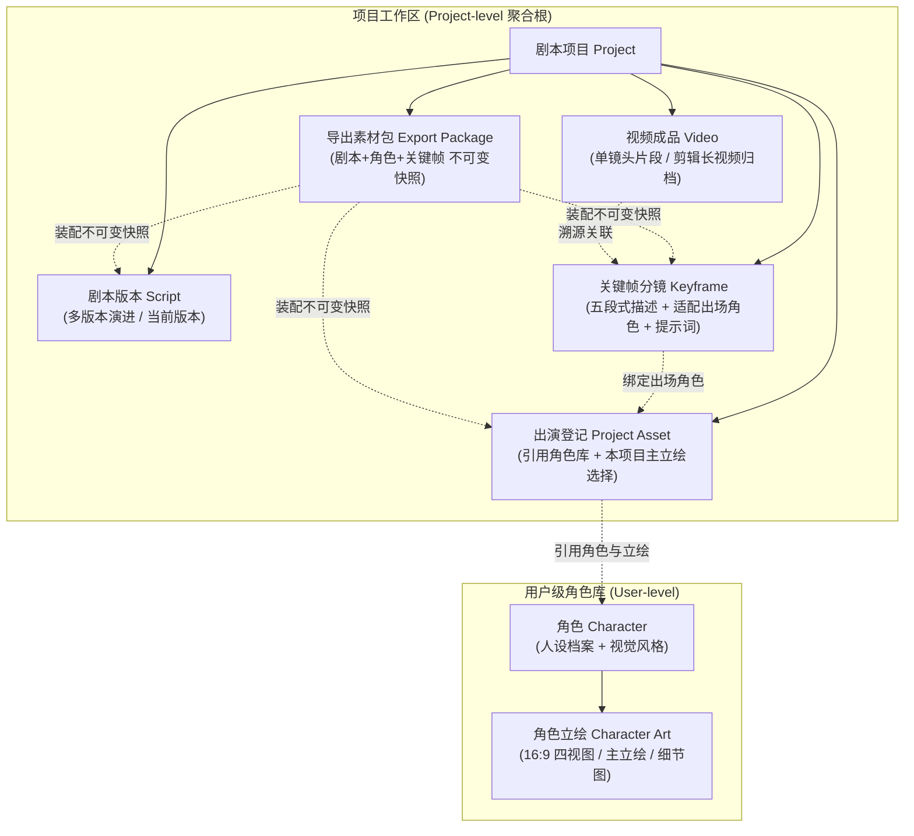
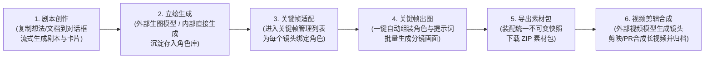
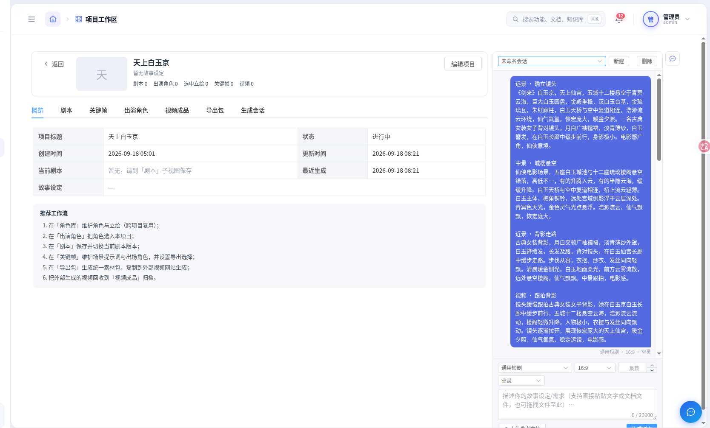
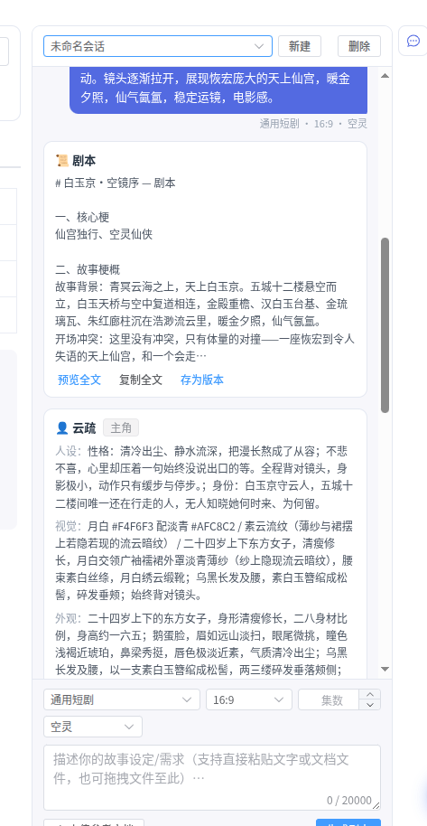
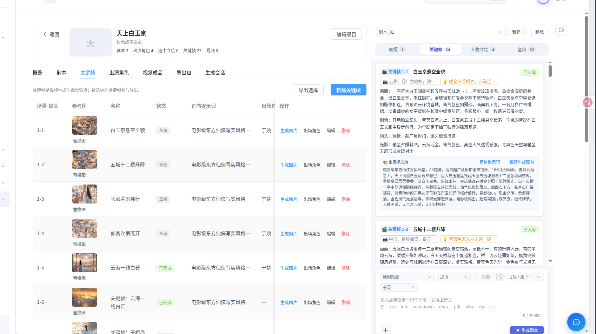
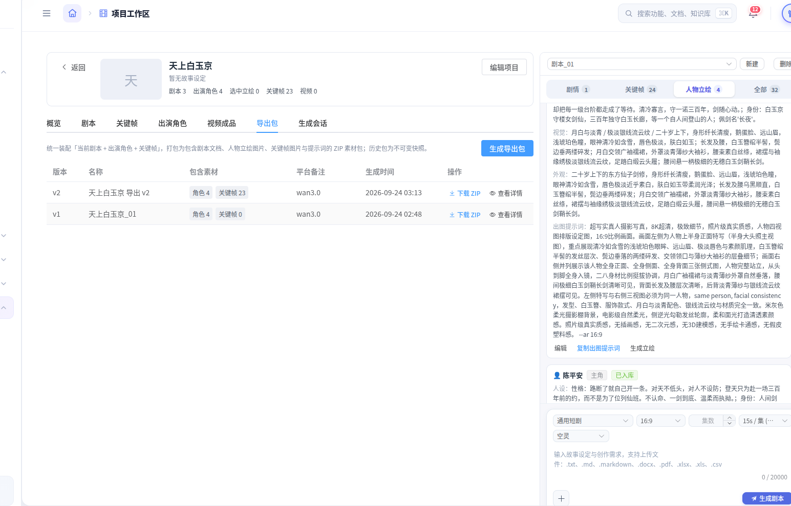

# Story 剧本与分镜系统 - Preview 

Story 系统是面向短剧、漫剧、商业广告及 AI 视频创作者的**全流程自动化剧本编排、视觉资产沉淀与分镜工坊**。系统通过大语言模型与多模态生图模型的协同编排，完成从灵感构思、标准化剧本创作、人物四视图立绘设计、关键帧分镜适配与自动化出图，到一键打包导出统一素材包的完整工作闭环，赋能外部视频生成大模型（如 Wan3.0、可灵 Kling、Runway、Sora、Seedance 等）与后期剪辑合成。

---

## 1. 先决条件与环境准备

1. **PostgreSQL 18.0+**
   - Story 模块表结构使用内置 `uuidv7()` 作为主键默认值，要求 PostgreSQL ≥ 18。
   - 执行建表脚本：`database/sql/story_schema.sql`（包含 `story` schema 下项目、角色、立绘、剧本、关键帧、导出包、生成任务与视频成品等全套数据表）。
2. **AI 模型配置**（前端「模型管理 / 参数管理」页维护，免重启热更新）：
   - **文本生成模型（Chat / Rewrite）**：如 `Qwen3.8-flash`、`DeepSeek-flash`、`gemini3.8-flash`、`gpt-5.6-luna` 等，需支持 Tool Calling / Function Call，用于驱动技能文档阅读与双轨结构化剧本输出；
   - **图像生成模型（Image）**：如 `gpt-image2.5`、`gpt-image-2.0` OpenAI  兼容接口，需支持高分辨率出图与参考图输入（图生图/多模态控制），用于人物立绘与关键帧生成；
   - **多模态理解模型（Visual，可选）**：如 `Qwen3.8-flash`、`Step-3.7`、`gpt-5.6-terra`，支持用户上传剧情参考图、分镜手稿或人设原案的视觉解析。
3. **系统菜单配置**：
   - 确认系统管理内已挂载「剧本工坊」与「角色库」菜单（前端对应路由 `story/projects` 与 `story/character`），并为目标角色分配访问权限。

---

## 2. 系统架构与核心资产模型

Story 体系以**项目为聚合根**，以**用户级角色库**为长期跨项目视觉资产基座，核心分工如下：



### 核心资产清单

| 资产对象 | 归属层级 | 核心职责 |
|---|---|---|
| **剧本项目 (`story_projects`)** | 项目聚合根 | 承载单部短剧的完整生命周期，记录风格、制作参数、资产计数与任务状态 |
| **角色与立绘 (`story_characters` / `story_character_arts`)** | 用户级跨项目库 | 存储角色结构化人设（性格/身份/专属色）与高清立绘（16:9 四视图等），跨项目复用 |
| **项目剧本 (`story_scripts`)** | 项目级 | 承载版本化剧本文本，由 `is_current` 单点标记当前活跃版本 |
| **关键帧分镜 (`story_keyframes`)** | 项目级 | 视频生成的视觉锚点；记录（场景-镜头）编号、五段式视听描述、参考图与出图提示词 |
| **分镜出场角色 (`story_keyframe_characters`)** | 项目级关联 | 记录每个分镜镜头登场的角色、使用的立绘参考图、角色位姿与镜头专属状态描述 |
| **不可变导出包 (`story_export_packages`)** | 项目级快照 | 固化「当前剧本 + 出演角色 + 选中关键帧」生成的统一素材包（ZIP），支持版本溯源 |
| **视频成品 (`story_videos`)** | 项目级 | 回收并归档外部视频模型生成的单镜头视频与后期剪辑合成的长视频，闭环生命周期 |

---

## 3. 核心使用说明（端到端创作工作流）

系统提供从**灵感构思、立绘生成、分镜适配、出图渲染、材料导出到成片归档**的 6 步标准闭环工作流：



---

### 步骤一：输入创作需求，生成标准化剧本与卡片

1. **新建/进入剧本项目**：在「剧本工坊」列表中新建或打开已有项目，进入项目工作区。
2. **唤出 AI 创作抽屉**：点击工作区右侧的 AI 故事生成抽屉；支持新建对话会话或切换历史创作会话。
3. **设置制作参数**：
   - **风格预设**：选择视频风格（如 `通用短剧`、`上美影动画`、`手绘日记` 等，不同风格自动激活对应的专业编剧技能与分镜提示词配方）；
   - **画幅比例**：选择输出比例（推荐默认 `16:9` 横屏电影感，也支持 `9:16` 竖屏短剧或 `4:3` 传统画幅）；
   - **集数与单集时长**：设定集数与单集预估秒数（**建议单集控制在 15s 或 30s**，严格匹配 AI 视频大模型分镜时长与运镜节奏）；
   - **基调与风格词**：可填入基调（如 `空灵`、`冷峻`、`悬疑`、`热血` 等）。
4. **输入故事构思 / 上传参考文档**：
   - 在底部输入框中粘贴您的大致剧情大纲、小说段落、对话灵感；
   - 支持点击「+」上传或拖拽文件（支持 `.txt`、`.md`、`.markdown`、`.docx`、`.pdf`、`.xlsx` 等），系统会自动解析文档内容注入上下文；也可上传参考图片供视觉模型分析。
5. **流式生成剧本与产物卡片**：
   - 点击「生成剧本」，大模型将基于专业技能规则进行流式构思输出；
   - 生成完毕后，系统采用**双轨解析机制**，自动生成并呈现三大产物卡片：
     - **📜 标准化剧本卡片**：包含核心梗、故事梗概、一句话卖点、人物小传（带稳定角色编号预留）、剧本大纲与正文（严格以 `△ 【关键帧 场次-镜头】` 锚定每个镜头及预估秒数）；
     - **👤 人物立绘卡片**：自动提取人设、视觉特征、专属主色，并生成包含 **16:9 四视图黄金排版**（半身大头正面特写 + 全身正面/侧面/背面三视图）的专业出图提示词；
     - **🎬 关键帧分镜卡片**：自动拆解出剧本的全部关键帧，附带景别运镜、画面视觉、光影氛围、预估时长及专业出图提示词。



*图 3-1：项目工作区概览与 AI 创作抽屉（支持参数设置、文本与文档导入、流式剧本生成）*



*图 3-2：AI 产物卡片展示（标准化剧本卡片支持存为版本与提取角色；角色卡片展示人设、视觉与出图提示词）*

---

### 步骤二：人物立绘生成与角色沉淀入库

针对 AI 输出的人物立绘卡片，系统提供**双通道出图**与**资产一键沉淀**支持：

1. **双通道生图方式**：
   - **通道 A（直接内部生成立绘）**：在角色卡片上点击「生成立绘」按钮，可按需微调尺寸（默认横版 `1536x1024` / `16:9`）与画质档位，系统将自动发起生图任务并轮询，生成完成后直接在会话中预览；
   - **通道 B（外部图像大模型生成）**：点击「复制出图提示词」，复制系统生成的 16:9 四视图结构化提示词（已内置主体特征、排版结构、同人一致性约束及真实质感负向词），前往 Midjourney、FLUX、Stable Diffusion 或外部生图网站出图，下载满意的立绘图片后回传。
2. **角色卡编辑与沉淀入库**：
   - **编辑人设**：点击卡片上的「编辑」按钮，可在入库前自由微调角色的性格、外貌特征与出图提示词；
   - **存入角色库**：点击「存入角色库」，系统支持：
     - **新建角色**：将该角色沉淀到当前用户的独立角色库中，供跨项目长期复用；
     - **合并到已有角色**：若库内已存在同名角色，可选择合并收编新立绘；
     - **自动出演登记**：角色入库的同时，系统会自动将该角色登记入当前项目的「出演角色」列表中。
3. **剧本版本沉淀**：
   - 在剧本卡片上点击「存为版本」，输入版本标题并勾选「设为当前版本」，将生成的剧本文本固化为项目的正式剧本（如 `v1`、`v2`）。

---

### 步骤三：进入关键帧管理列表，为关键帧适配角色

1. **切换到「关键帧」面板**：
   - 点击工作区左侧导航的「关键帧」选项卡；
   - 可在 AI 抽屉中点击「存入关键帧」（或在卡片上点击「跳转生成图片」），系统会自动将 AI 分镜保存至项目的正式关键帧库中；也可点击「一键存入全部关键帧」批量沉淀。
2. **浏览关键帧列表**：
   - 关键帧列表按 `场景号-镜头号`（如 `1-1`、`1-2`、`1-3`）严格排序；
   - 每行清晰展示：镜头编号、参考缩略图、镜头名称、状态（草稿 / 生成中 / 已完成）、正向提示词摘要、已绑定的出场角色以及操作项。
3. **出场角色适配（核心步骤）**：
   - 点击对应关键帧操作列的 **「出场角色」** 按钮；
   - 弹窗将列出本项目在「出演角色」中登记的全部角色：
     - **勾选登场角色**：勾选该镜头中出现的人物（如 `云疏`、`陈平安` 等）；
     - **选择参考立绘**：为该角色选择最适合该镜头的立绘参考图（默认使用 16:9 四视图或主立绘）；
     - **指定角色级别**：设置主角（`main`）、配角（`secondary`）或背景人物（`background`）；
     - **补充镜头专属状态**：在「镜头状态」输入框中可针对本分镜补充角色动作与表情（如 `长廊中缓步前行，背影微侧`、`拔剑出鞘，眼神凌厉`）。
   - 点击保存，完成该关键帧的角色空间绑定与状态配置。



*图 3-3：关键帧管理列表与出场角色适配（支持出场角色绑定、提示词精修与自动化生成图片）*

---

### 步骤四：点击生成图片，自动化组装并提交生图

1. **发起关键帧生图**：
   - 在关键帧列表对应行中，点击 **「生成图片」** 操作按钮；
   - 若尚未设置出场角色，系统会弹出智能提示：建议先绑定角色立绘以保证一致性，亦可针对空镜头或纯场景继续直接生成。
2. **全自动组装机制（保证角色与画面一致性）**：
   - 后端 `KeyframeService` 自动执行以下提示词与视觉资产装配：
     - **正向画面提示词**：读取关键帧原设的五段式场景、视觉、运镜与画质提示词；
     - **角色特征与局部状态**：根据绑定的出场角色，自动追加注入角色外观描述与镜头状态（格式：`出场角色：角色名（设定：外观描述；镜头状态：该镜头具体动作表情）`）；
     - **参考图多模态控制**：自动提取已绑定角色的高清立绘图片文件（`reference_images`），作为图像大模型的形象基准输入；
3. **后台异步渲染与轮询**：
   - 系统将任务提交给底层配置的图像大模型；
   - 状态实时流转为「生成中」，前台自动启动平滑状态轮询；支持随时点击「中断生图」释放项目任务互斥锁；
   - 生图完成后，状态自动切换为「已完成」，列表即刻呈现高清分镜画面，并支持点击放大预览或手动替换本地修改图。

---

### 步骤五：导出材料包，获取完备的项目资产快照

分镜画面准备齐全后，进入素材包导出流程：

1. **导出选择（可选）**：
   - 在关键帧面板点击「导出选择」，可按需要挑选特定分镜参与导出，并调整导出顺序；若未特别挑选，默认导出项目下全部有效关键帧。
2. **生成导出包**：
   - 切换到左侧 **「导出包」** 面板，点击 **「生成导出包」** 按钮；
   - 填写导出包名称与目标平台备注（如 `wan3.0`、`kling`、`runway` 等），点击确定。
3. **统一不可变快照装配**：
   - 系统自动装配「当前剧本 + 出演角色 + 选中关键帧」，生成版本递增的不可变快照记录；后续剧本或关键帧的修改均不会影响已归档的历史导出包。
4. **下载与解压 ZIP 素材包**：
   - 点击列表中的 **「下载 ZIP」**，浏览器将直接启动原生流式下载。



*图 3-4：材料导出包面板（支持不可变版本归档、在线素材快照预览与一键下载完整 ZIP 包）*

#### 统一素材包解压目录规范

下载的 ZIP 压缩包已针对视频大模型与后期制作进行了标准化工程归档：

```text
《天上白玉京》视频生成素材包_v2.zip
├── 剧本/
│   ├── 剧本.md                          # 完整排版的 Markdown 格式剧本
│   └── 剧本.txt                         # 适合直接复制的纯文本剧本
├── 人物立绘/
│   ├── 角色总览.txt                      # 本剧出演角色名单、人设与视觉总览
│   ├── 01_云疏/
│   │   ├── 角色信息.txt                  # 云疏的独立人设、服饰风格、外观描述
│   │   └── 01_主视图+三视图_主立绘.png    # 16:9 高清四视图立绘图片
│   └── 02_陈平安/
│       ├── 角色信息.txt                  # 陈平安的独立人设与描述
│       └── 01_主视图+三视图_主立绘.png    # 高清立绘原图
├── 关键帧/
│   ├── 关键帧总览.txt                    # 全部镜头的场景号、镜头号与运镜汇总
│   ├── 01_场景1-镜头1_白玉京悬空全貌_提示词.txt  # 该镜头的独立提示词、运镜与出场角色说明
│   ├── 01_场景1-镜头1_白玉京悬空全貌.png        # 自动化生成的关键帧高清画面图片
│   ├── 02_场景1-镜头2_五城十二楼升降_提示词.txt
│   ├── 02_场景1-镜头2_五城十二楼升降.png
│   └── ...                              # 更多分镜图文素材按镜头序号排列
├── 完整提示词与说明.txt                   # 全片一键复制总览文档（含剧本、角色与所有镜头）
└── manifest.json                        # 机器友好的结构化快照元数据（JSON 格式）
```

---

### 步骤六：自行在外部视频模型生成，并编辑合成长视频

1. **外部视频大模型生成单镜头片段**：
   - 打开解压后的素材包，进入 `关键帧/` 目录；
   - 登录外部视频生成平台（如 **Wan 2.1 / Wan 3.0**、**可灵 AI Kling**、**Runway Gen-3**、**Sora**、**即梦 Jimeng**、**Pika** 等）；
   - **图生视频工作流**：将每个镜头的关键帧高清图片（如 `01_场景1-镜头1_白玉京悬空全貌.png`）上传为起始帧或参考底图；
   - **运镜与动态提示词**：打开对应的 `_提示词.txt`，复制其中的镜头运镜描述与场景动作提示词，输入视频平台生图框；
   - 结合剧本标注的单镜头预估秒数（如 2~5 秒），渲染产出对应的动态视频切片。
2. **后期长视频剪辑与音效合成**：
   - 打开剪辑软件（如 **剪映 / CapCut**、**Adobe Premiere Pro**、**DaVinci Resolve** 等）；
   - **素材导入与音画对齐**：
     - 参考 `剧本/剧本.md`，将生成的各镜头视频片段按场景与镜头顺序拖入时间线；
     - 使用 TTS 语音合成或专业配音录制台词与旁白音频；
     - 根据正文中的情绪节奏与镜头秒数剪辑画面，添加转场、音效（SFX）与背景音乐（BGM）；
   - 导出为完整的高清长视频成片（如 MP4 / MOV）。
3. **视频成品回收与溯源归档（可选）**：
   - 返回 Story 系统，进入项目的 **「视频成品」** 面板；
   - 支持将外部生成的单镜头视频切片或最终长视频成片上传归档；
   - 系统自动提取视频首帧作为封面，并可关联对应的关键帧、剧本版本与导出包，形成完整的创作成品沉淀。

---

## 4. 关键设计规范与技术特色

### 4.1 双轨输出契约（Dual-Track Output Contract）

为解决大语言模型自由文本创作与系统结构化落库之间的冲突，Story 采用自定义围栏双轨契约：
- **第一轨（剧本全文）**：模型严格按六段式结构（核心梗、梗概、卖点、人物小传、大纲、剧本正文）输出可读文本；
- **第二轨（结构化资产数据块）**：文本末尾使用独占标记 `<<<STORY_CARDS>>>` 与 `<<<END_STORY_CARDS>>>` 包裹包含 `characters`（角色卡）与 `keyframes`（关键帧清单）的 JSON 数据；
- **服务端剥离与安全落库**：后端在流式生成完成时，单点切分正文与 JSON 块，剧本正文落库为剧本消息，角色卡与关键帧作为子卡片即时展示并支持独立交互沉淀。

### 4.2 16:9 人物四视图黄金立绘规范

系统内置《人物特写与三视图立绘设计规范》，角色立绘默认强制要求 **16:9 比例画面** 与 **四视图黄金排版**：
- **排版结构**：
  - **左侧**：单人半身大头正面特写作为主视图（重点展现五官神态、发饰、妆容细节与服饰领口）；
  - **右侧**：横向并列展示该角色的 **全身正面**、**全身侧面**、**全身背面** 三视图（从头到脚完整站立，真实人体比例）。
- **同人一致性法则**：提示词中明确锁定 `Same identity, facial consistency`，保证发型、服饰款式、色彩纹样与材质在四个视图中完全一致；
- **真实质感防偏**：采用【画面类型 + 排版结构 + 人物本体 + 造型细节 + 材质描述 + 光影背景 + 风格限制】五大模块结构化编写，加入电影级柔光棚背景与质感词，避免脸谱化与机械堆砌。

### 4.3 关键帧五段式描述与时间切片

每个分镜关键帧严格遵循电影视听镜头语言规范：
- **单集生成时长硬规则**：单集总时长严格控制在 **≤15s 或 ≤30s**（适配当前 AI 视频模型生成上限），每个镜头必须明确预估秒数（如 2~4 秒）；
- **人物编号与画面空间位置标记**：出场人物标明稳定编号（如 `【角色1·林冲】`），镜头描述中必须明确人物在画面中的出现空间（如 `[画面中央]`、`[前景左侧]`、`[背景右侧]`），确保空间调度清晰；
- **五段式专业结构**：
  1. **场景剧情描述**：剧情事件、人物行为与台词；
  2. **画面视觉描述**：构图布局、人物站位调度、表情动态；
  3. **镜头运镜描述**：景别（远景/全景/中景/特写）与摄影机运动（推/拉/摇/移/俯拍）；
  4. **光影氛围描述**：光源方向、色彩冷暖、环境气氛；
  5. **专业出图提示词**：包含艺术媒介、主体描述、环境背景、光影画质的完备出图 Prompt。

---

## 5. API 路由速查

所有路由均挂载于 `ENV.base_url` 下的 `/story` 前缀：

| 模块分类 | 请求方式 | 接口路径 | 功能描述 |
|---|---|---|---|
| **剧本生成** | `GET` | `/story/styles` | 获取视频风格注册表枚举（通用短剧、上美影动画等） |
| | `POST` | `/story/upload-image` | 上传多模态对话或生图参考图片 |
| | `POST` | `/story/sessions/{session_id}/generate` | 发起流式剧本生成（SSE，think/answer/done 事件） |
| | `POST` | `/story/sessions/{session_id}/stop` | 停止在途剧本生成任务 |
| **资产沉淀** | `POST` | `/story/messages/{message_id}/save-script` | 剧本卡存为项目剧本新版本（可选设为当前版本） |
| | `POST` | `/story/messages/{message_id}/save-character` | 角色卡存入角色库（支持新建或并入，自动登记出演） |
| | `POST` | `/story/messages/{message_id}/generate-art` | 从角色卡直接发起内部人物立绘生成任务 |
| | `POST` | `/story/messages/{message_id}/save-keyframe` | 将会话关键帧卡存入项目关键帧库 |
| | `POST` | `/story/sessions/{session_id}/save-keyframes` | 一键将当前会话中的全部关键帧存入关键帧库 |
| **关键帧管理** | `GET` | `/story/projects/{project_id}/keyframes` | 分页查询项目关键帧列表（按镜头编号升序） |
| | `PUT` | `/story/keyframes/{keyframe_id}/characters` | 为关键帧配置出场角色（绑定立绘与镜头状态） |
| | `POST` | `/story/keyframes/{keyframe_id}/generate-image` | 自动组装角色与提示词，发起关键帧生图 |
| | `POST` | `/story/keyframes/{keyframe_id}/stop` | 中断在途的关键帧图片生成任务 |
| | `POST` | `/story/keyframes/{keyframe_id}/image` | 手动上传或替换关键帧参考图片 |
| **导出包** | `POST` | `/story/projects/{project_id}/exports` | 装配「剧本+角色+关键帧」并创建不可变导出包快照 |
| | `GET` | `/story/projects/{project_id}/exports` | 获取导出包快照历史列表 |
| | `GET` | `/story/exports/{package_id}/download` | 下载统一素材包 ZIP 归档文件 |
| **视频归档** | `POST` | `/story/projects/{project_id}/videos` | 登记外部生成的视频成品（单镜头片段或成片） |
| | `GET` | `/story/projects/{project_id}/videos` | 分页查询项目归档的视频成品列表 |
